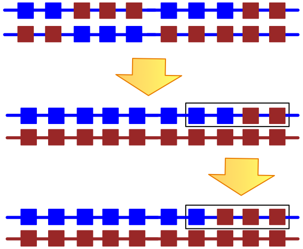

\newpage

# Introduction

## Crossing Scheme and Experimental Design


In this experiment, we selfed and outcrossed a set of ~70 teosinte landraces to get a progeny array composed of 4,875 individuals. The ~70 founders and all the progeny were genotyped using GBS. We also re-sequenced 20/70 founder lines (the others will be re-sequenced soon). Because of the high error rate of the GBS data, especially problematic for calling heterozygous sites, we employed a phasing and imputation strategy to infer the expected genotypes by combining parentage and GBS information.

This file is to document the `R` package we developed to solve the problems step by step.

## Install and Usage

Install devtools first, and then use devtools to install imputeR from github.

```{r, eval=FALSE}
# install and load devtools
devtools::install_github("hadley/devtools")
library(devtools)
# install and load imputeR
install_github("yangjl/imputeR")
library(imputeR)
```

## How to find help
Within "R" console, type `?impute_parent` or `help(impute_parent)` to find help information about the function.

```{r}
?impute_parent
```

## How to load hdf5 file
To load `hdf5` file, you need to install Vince's [tasselr](https://github.com/vsbuffalo/tasselr). If you fail to install them, please follow the above links and install the required dependencies. Note package "rhdf5" is a Bioconductor package, you have to use `biocLite` to install it.


```{r, eval=FALSE}
# install devtools and then install the devlopmental version 
# of tasselr and ProgenyArray using devtools. 
devtools::install_github("hadley/devtools")
library(devtools)
source("https://bioconductor.org/biocLite.R")
biocLite("rhdf5")
install_github("vsbuffalo/tasselr") 
# to load the packages
library(tasselr)
```

The following several lines help you to reformat the `*.h5` HDF5 file into an R object. You need to specify the path of the HDF5 file.
Here is the Teosinte data:
```{r, eval=FALSE}
# Note: at least 100G memory will be needed to load the hdf5 file
# load h5file
teo <- initTasselHDF5("largedata/teo.h5", version="5")
teo <- loadBiallelicGenotypes(teo, verbose = TRUE)
# reformat to imputeR object
# find help with ??imputeRob
ob1 <- imputeRob(h5=teo, missingcode=3)
save(file="largedata/teo.RData", list="ob1")  
```

Here is the landrace data:
```{r, eval=FALSE}
# Note: at least 100G memory was needed to load the hdf5 file
# load h5file
land <- initTasselHDF5("largedata/maize_landrace.h5", version="5")
land <- loadBiallelicGenotypes(land, verbose = TRUE)
# reformat to imputeR object
ob2 <- imputeRob(h5=land, missingcode=3)
save(file="largedata/bode_data.RData", list="ob2")
```

\newpage

# Infer parental genotype

If we have parent's WGS data, this step can be skipped.

We have observed mom, dad and observed (selfed) kids.  We want to know $P(G|\theta)$, or the probability of mom's genotype (focal parent) given observed data $\theta$. And according to [Bayes' theorem](https://en.wikipedia.org/wiki/Bayes%27_theorem), 

$P(G|\theta) \propto P(\theta|G) \times P(G)$,   

where $P(G)$ is the probability of the genotype according to the Hardy-Weinberg equilibrium estimated from the population.
This consists of observed genotypes ($G'$) of mom, dad and kids. So:

$P(G_m|\theta)\propto T(G_k|G_m, G_d) \times P(G'_m|G_m)\times P(G'_d|G_d) \times P(G'_k|G_k)\times P(G_m)\times P(G_d)$,  

where $T(G_k|G_m, G_d)$ is the transmission probability of kid genotype given mom and dad's genotype $G_m$ and $G_d$. 
And, $P(G'|G)$ (including $P(G'_m|G_m), P(P'_d|G_d), P(G'_k|G_k)$) is the probability of observed genotype given a true genotype $G$ by considering error rates, i.e. GBS homozygote error = 0.02 and heterozygote error = 0.8.
$P(G_m), P(G_d)$ is the probability of the genotype according to Hardy-Weinberg equilibrium estimated from the population. 

We sum of the log probabilities over all kid and get the maximum likelihood genotype of the focal parent. The function `impute_parent` was implemented to compute mom's genotype probabilities.

## Example: step by step
In the below toy example, we simulate a family of self and outcross progeny with 50 kids for 3 loci. We will assume 50% missing data, and 50% selfing rate. 

Load the packages.
```{r, eval=TRUE}
library(devtools)
library(imputeR)
```

First we set some parameters for simulation
```{r}
    source("~/Documents/Github/imputeR/R/utils.R")
    source("~/Documents/Github/imputeR/R/ImputeParent.R")
    misscode = 3 # code for missing data
    numloci=3 # number of loci
    hom.error=0.02 #homozygous error rate
    het.error=0.8 #heterozygous error rate
    imiss=0.5 # % missing data
    selfing=0.5 # selfing rate
    size.array=50 # family size
    rec=0.25 # mean number of crossovers per chromosome
```

Then we make our focal parent
```{r}

    sfs <- getsfs() # make neutral SFS
    p <- sample(sfs, numloci, replace=TRUE) # get sample of allele freqs from SFS
    
    ### make focal_parent using a data.frame
    sim_focal <- data.frame(hap1=ran.hap(numloci,p), hap2=ran.hap(numloci,p))
```


What is our focal parent's real genotype:
```{r}
    sim_focal
```


Now we make our set of parents for each of our progeny. The first `outcrossed` parents are random, 
then next `size.array - outcrossed` are just the focal parent.
```{r}
    #first outcrossed
    outcrossed=rbinom(n=1,prob=(1-selfing),size=size.array)
    out_parents <- vector("list", outcrossed)
    out_parents <- lapply(1:outcrossed, function(i) 
        data.frame(hap1=ran.hap(numloci,p), hap2=ran.hap(numloci,p)) )
    #now selfed
    self_parents <- vector("list", size.array-outcrossed)
    self_parents <- lapply(1:(size.array-outcrossed), function(i) sim_focal )
    #combine
    if(outcrossed==0){
        parent_array=self_parents  
    }else if (outcrossed==size.array){
        parent_array=out_parents
    }else{
        parent_array=c(out_parents,self_parents)
    }

    #now we make their diploid genotypes, 
    #we add the focal parent on to the end of the parents array
    parents<-lapply(parent_array, function(q) q[,1]+q[,2]  )
    parents[[size.array+1]]=c(sim_focal[,1]+sim_focal[,2])
    #finally, add error to make some crappy gbs_parents
    gbs_parents=lapply(parents, function(a) add_error(a,hom.error,het.error))
```

Now we make a progeny array for these parents.
```{r}
    progeny <- vector("list", size.array)
    #use the kid function!
    #each entry in progeny list has two vectors. [[1]] is true genotype, [[2]] is observed
    progeny <- lapply(1:size.array, function(a) 
        kid(p2=list(parent_array[[a]][,1], parent_array[[a]][,2]), 
            p1=list(sim_focal[,1],sim_focal[,2]), 
            het.error, hom.error, rec, imiss, misscode))
    
    #now setup observed kids
    obs_kids=list()
    for(i in 1:size.array){ obs_kids[[i]]=progeny[[i]][[2]] }
```

Now we impute the focal parent
```{r}
    #which parent is our focal one? Here we set to end of parents array for ease
    obs_parent=size.array+1 #focal parent
    #which parents are the other parent of each offspring. 
    #These are in order since we simulated them that way.
    other_parents=c(1:outcrossed,rep(obs_parent,size.array-outcrossed)) #list of other parents

```


## Simulation using `imputeR` package

Above simulation steps were packed into a funcion `sim.array`. 
This function will simulate a `GBS.array` object for the following functions to use.

```{r}
# find help
?sim.array
# make the simulation repeatable
set.seed(1234)
GBS.array <- sim.array(size.array=50, numloci=100, hom.error = 0.02, het.error = 0.8,
  rec = 0.25, selfing = 0, imiss = 0.5, misscode = 3)
```

We now impute parent genotypes using `impute_parent` and extract results using `parentgeno`. In the resulting table `res`, the first three columns are the probabilities of genotype `0, 1, 2`. The 4th column is the odd ratio of the highest divided by the 2nd highest probability. `gmax` parent's genotype with the highest probability. `gor` parent's genotype with the highest probability and `OR` bigger than the specified threshold.

```{r, eval=TRUE}
#The stuff:
inferred_geno_likes <- impute_parent(GBS.array, hom.error=0.02, het.error=0.8, imiss=0.5)
res <- parentgeno(inferred_geno_likes, oddratio=0.6931472, returnall=TRUE)
res$true_parent <- GBS.array@true_parents[[50]]$hap1 + GBS.array@true_parents[[50]]$hap2
#error rates
nrow(subset(res, gmax != true_parent ))/nrow(res)
nrow(subset(res, gor != true_parent & gor !=3 ))/nrow(res)
```

We also did ~100 simulations with size.array varied from 10 to 100. The results was plotted as below. When the size.array increased to more than 40, the error rates using both methods reduced to almost zero. It indicated that, with more than 40 kids the parent genotype can be confidently imputed.


## Real Data

Then, for each parent, run `impute_parent` as in the toy example above. Note that you will need to supply a vector of allele frequencies at each locus estimated from the parents. If you do not supply this or leave `p=NULL`, a random allele frequency drawn from the neutral SFS will be used instead (this is Very Bad).  Since parents are coded as 0,1, or 2 for $N$ parents the allele frequency $p$ at a locus can be calculated as $\frac{\sum_{i=1}^Np_i}{2N}$.

An even better way to estimate frequency: taking only the parents (~50) with selfed offspring, simply average the genotypes of the selfed offspring, sum, and divide by ~100.  This should get a really good estimate of allele frequency. I would also start by dropping any locus for which you don't observe the non reference allele some minimum number (10 sounds good to me) of times. Finally, keep in mind that the frequency we are working with here is the non reference allele.

A new function "create_array" will read in the `Geno4imputeR` object, calculate allele freq from the selfed offspring, and split the data into different families. A set of GBS.array objects will be generated in the specified location for imputation.

```{r, eval=FALSE}
library(imputeR)

load(file="largedata/teo.RData")
Geno4imputeR <- ob1
ped <- read.table("data/parentage_info.txt", header =TRUE)

ob2 <- create_array(Geno4imputeR, ped, outdir="largedata/",
                    maf_cutoff=0.002, lmiss_cutoff=0.8, imiss_cutoff=0.8, size_cutoff=40)

# run through each RData objects and collected the data into 10 data.frames (chromosomes)
# I ran it using a cluster to reduce computing time.
files <- list.files(path="largedata/obs", pattern="RData", full.names=TRUE)
for(JOBID in 1:length(files)){
    o <- load(files[JOBID])
    tem <- impute_parent(GBS.array=obj, hom.error = 0.02, het.error = 0.8, imiss = 0.5)
    res <- parentgeno(tem, oddratio=0.69, returnall=TRUE)

    outfile <- gsub("RData", "csv", files[JOBID])
    write.table(res, outfile, sep=",", row.names=FALSE, quote=FALSE)
}

```

The imputed parent (N=50) genotypes (seprated by chromosomes) had been deposited in this dir: `~/Documents/Github/phasing/largedata/ip/`.
These 10 files will be available upon request.

\newpage

# Phasing focal parent's haplotype 

According to Bayes' theorem, we got:

$$P(H_f|\theta) \propto P(\theta|H_f) \times P(H_f)$$  

- Where $\theta$ denotes observed data.
- $P(H_f)$ is the probability of our focal parent's haplotypes for a given window size of $n$.

Our prior assumption for $P(H_f)$ is that all possible haplotypes are equally likely. So,

$$P(H_f | \theta) \propto P(\theta | H_f)$$  

We assume $H_i$ as the haplotype of the other parent for the $i$th kid. Because all possible haplotypes ($H_i$, p ranged from 1 to k) inherited from other parents constitute a partition of the sample space, which includes $k$ kids reproduced by the focal parent ($H_f$). The hapoltypes ($H_i$) are pairwise mutually exclusive. Therefore,

$$P(H_f|\theta) \propto \sum_{i=1}^{k} P(\theta | H_f, H_i)$$

It can be further expressed by:
$$P(H_f|\theta) \propto \sum_{i=1}^{k} P(K'_i | H_f, H_i)$$ 

$$P(H_f|\theta) \propto  \sum_{i=1}^{k}\prod\limits_{l=1}^{n}{P(G'_{i,l}|H_1, H_2)} $$


- $P(K'_i|H_f, H_i)$ is the probability of $i$th kid's haplotype given parents' haplotype of $H_f$ and $H_i$.
- $P(G'_{i,l} | H_f, H_i)$ is the probability of $i$th kid's genotype at locus $l$ given parents' haplotype of $H_f$ and $H_i$.

## Simulated data

We implemented a function `phase_parent` to do the phasing work. It was conducted in two steps by two major functions `phase_chunk` and `join_chunks`. First, we get the most likely focal parent's haplotype in a window. We then extend the window by one bp each time into a larger chromosomal chunk until the new haplotype in a window conflict with the existing chunk. In the conflict case, a new chromosomal chunk will be created. Second, we compute the possibilities of the haplotypes of two neighboring chunks. The most likely joined haplotype chunks will be returned by the function `join_chunks`.


```{r, eval=FALSE}
# to make the random events repeatable
set.seed(123457)
# simulate a GBS.array object
GBS.array <- sim.array(size.array=50, numloci=100, hom.error = 0.02, het.error = 0.8,
                       rec = 0.25, selfing = 0.5, imiss = 0.5, misscode = 3)
# get perfect parent genotype
GBS.array <- get_true_GBS(GBS.array)
# get probability matrices
probs <- error_mx(hom.error=0.02, het.error=0.8, imiss=0.5)
# phasing   
phase <- phase_parent(GBS.array, win_length=10, join_length=10, verbose=FALSE)
 
# compute error rate
out <- phase_error_rate(GBS.array, phase)
```

## Real data


\newpage

# Phasing and Imputing Kids  
$P(H_k|\theta) \propto P(\theta|H_k) \times P(H_k)$   
$P(H_k|\theta) \propto \left( \prod\limits_{i=k}{P(H'_k|H_k)} \right) \times P(H_k)$  
$P(H_k|\theta) \propto \left( \prod\limits_{i=k}\prod\limits_{l=1}^{n}{P(G'_{i,l}|H_k)} \right) \times P(H_k)$

- Where $\theta$ denotes observed data.
- $P(H)$ is the probability of the haplotype for a given window size of $n$.
- $P(G'_{i,l}|H)$ is the probability of kid $i$ at locus $l$ for a given haplotype $H$.
- The prior $P(H)$ is that all possible haplotypes of a given window size are equally likely.



1. We calculate the maximum likelihood of the inherited haplotypes for a given window.
2. We find hte munimum path of recombinations.
3. At the potential recombination sites, we will find the maximum likelihood of the breaking points.

## Simulated data
```{r, eval=FALSE}
# to make the random events repeatable
set.seed(123457)
# simulate a GBS.array object
GBS.array <- sim.array(size.array=50, numloci=10000, hom.error = 0.02, het.error = 0.8,
                       rec = 0.25, selfing = 0.5, imiss = 0.5, misscode = 3)
# get perfectly phased parents
GBS.array <- get_phased(GBS.array, maxchunk=3)
# get probability matrices
probs <- error_mx(hom.error=0.02, het.error=0.8, imiss=0.5)
# phasing   
phase <- impute_kid(GBS.array, winsize=10, verbose=TRUE)
 
# compute error rate
g1 <- phase@gbs_kids[[1]]$hap1 + phase@gbs_kids[[1]]$hap2
g2 <- phase@true_kids[[1]]
sum(g1!=g2)/length(g1)
```


